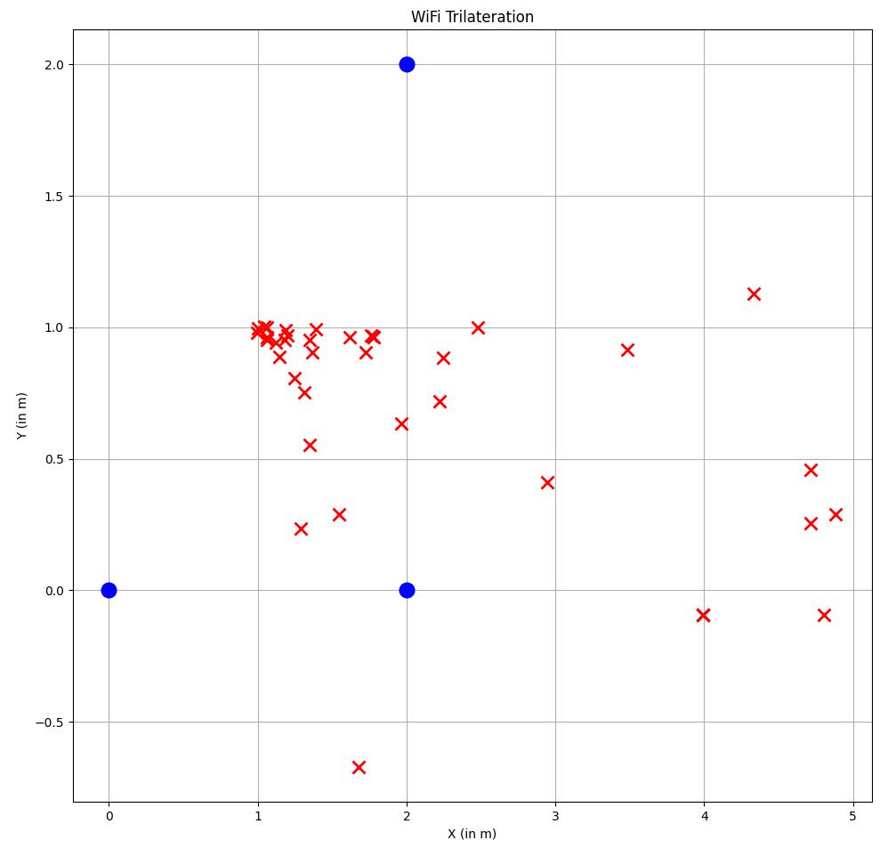

# Sensor
An RSSI-based Location Estimation of WiFi Devices using Trilateration and Log-Distance Path Loss Model.

## Overview
This repository contains a real-time indoor and outdoor positioning system utilizing distributed sensor nodes (ESP32) arranged in a polygonal geometry. The nodes passively sniff 802.11 WiFi Probe Requests and extract the device fingerprint (MAC-Address) and RSSI (Received Signal Strength Indicator) value upon reception. This data is immediately transmitted via UDP to a backend server, which caches the measurements. Once a sufficient number of measurements are collected from at least three distinct nodes for a single fingerprint, the system computes the device's position. The median of the associated RSSI values is calculated to produce a stabilized signal strength. This stabilized RSSI value is then converted into a geometric distance using the configurable Log-Distance Path Loss Model. These calculated distances, combined with the known (x, y) coordinates of the sensors, are fed into a trilateration algorithm to determine the final 2D position of the target device.

## API
The sensor positions and calculated trilaterations are available for retrieval via HTTP endpoints or a real-time WebSocket stream.

### Sensors
HTTP:
```
http://localhost:8080/api/sensors
```

WebSocket:
```
ws://localhost:8080/api/sensors/ws
```

Response:
```json
[
  {
    "id": 2,
    "x": 4.0,
    "y": 0.0,
    "lat": 50.56494466501721,
    "lon": 9.684520461933687,
    "environment": "FreeSpace"
  },
  {
    "id": 3,
    "x": 2.0,
    "y": 3.0,
    "lat": 50.5648945576323,
    "lon": 9.684697512562593,
    "environment": "FreeSpace"
  },
  {
    "id": 1,
    "x": 0.0,
    "y": 0.0,
    "lat": 50.56484445024739,
    "lon": 9.684520461933687,
    "environment": "FreeSpace"
  }
]
```

### Trilaterations
HTTP:
```
http://localhost:8080/api/trilaterations
```

WebSocket:
```
http://localhost:8080/api/trilaterations/ws
```

Response:
```json
[
  {
    "fingerprint": 11256099,
    "y": 0.8333333333333334,
    "x": 2.0,
    "lat": 50.5648945576323,
    "lon": 9.684569642663938
  }
]
```

## Configuration
Sensor nodes are configurable via a serial (USB/UART) connection, allowing setup of network credentials, the sensor ID, local (x, y) coordinates in meters, global (latitude, longitude) coordinates, and the environment type of the node position for the Log-Distance Path Loss Model.

## Result
The following image illustrates the positioning results of target devices (red dots) based on RSSI measurements from three sensor nodes (blue dots).



While the system demonstrates practical viability, achieving reliable estimations is highly dependent on significant fine-tuning, with the calibration of individual sensor nodes being the most critical factor.
